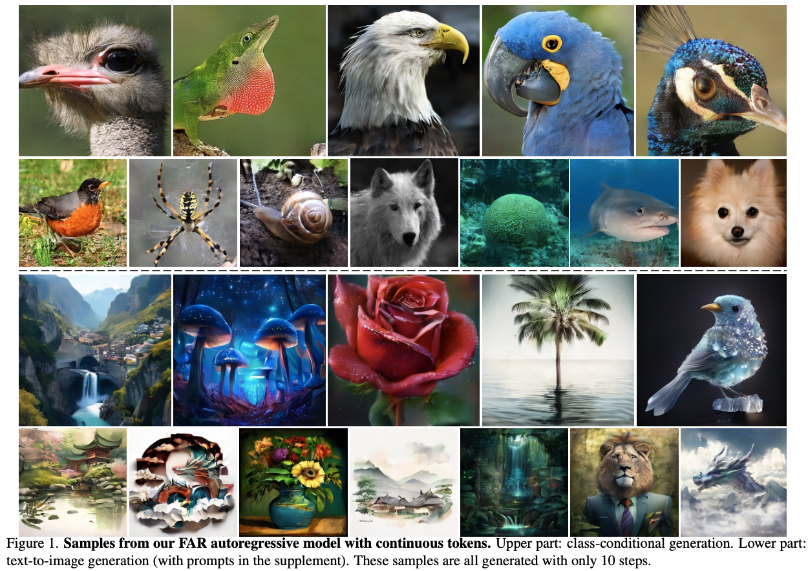

# Autoregressive Image Generation without Vector Quantization <br><sub>Official PyTorch Implementation</sub>

[](https://arxiv.org/abs/2406.11838)&nbsp;
[]([https://huggingface.co/jadechoghari/mar](https://huggingface.co/figereatfish/FAR))&nbsp;

<p align="center">
  
</p>


->

## 📰 News

- **[2024-08-06] 🎉🎉🎉 We have released [Lumina-mGPT](https://arxiv.org/abs/2408.02657), the next-generation of generative models in our Lumina family! Lumina-mGPT is an autoregressive transformer capable of photorealistic image generation and other vision-language tasks, e.g., controllable generation, multi-turn dialog, depth/normal/segmentation map estimation.**
- **[2024-07-08] 🎉🎉🎉 Lumina-Next is now supported in the [diffusers](https://github.com/huggingface/diffusers)! Thanks to [@yiyixuxu](https://github.com/yiyixuxu) and [@sayakpaul](https://github.com/sayakpaul)! [HF Model Repo](https://huggingface.co/Alpha-VLLM/Lumina-Next-SFT-diffusers).**
- [2024-06-26] We have released the inference code for img2img translation using `Lumina-Next-T2I`. [CODE](https://github.com/Alpha-VLLM/Lumina-T2X/tree/main/lumina_next_t2i_mini/scripts/sample_img2img.sh) [ComfyUI](https://github.com/kijai/ComfyUI-LuminaWrapper)
- [2024-06-21] 🥰🥰🥰 Lumina-Next has a jupyter nootbook for inference, thanks to [canenduru](https://github.com/camenduru)! [LINK](https://github.com/camenduru/Lumina-Next-jupyter)
- [2024-06-21] We have uploaded the `Lumina-Next-SFT` and `Lumina-Next-T2I` to [wisemodel.cn](https://wisemodel.cn/models). [wisemodel repo](https://wisemodel.cn/models/Alpha-VLLM/Lumina-Next-SFT)
- [2024-06-19] We have released the `Lumina-T2Audio` (Text-to-Audio) code and model for music generation. [MODEL](https://huggingface.co/Alpha-VLLM/Lumina-T2Audio)
- [2024-06-17] 🚀🚀🚀 We have support both inference and training (including Dreambooth) of SD3, implemented in our Lumina framework! [CODE](https://github.com/Alpha-VLLM/Lumina-T2X/tree/main/lumina_next_t2i_mini)
- **[2024-06-17] 🥰🥰🥰 Lumina-Next supports ComfyUI now, thanks to [Kijai](https://github.com/kijai)! [LINK](https://github.com/kijai/ComfyUI-LuminaWrapper)**
- **[2024-06-08] 🚀🚀🚀 We have released the `Lumina-Next-SFT` model, demonstrating better visual quality! [MODEL](https://huggingface.co/Alpha-VLLM/Lumina-Next-SFT)**
- [2024-06-07] We have released the `Lumina-T2Music` (Text-to-Music) code and model for music generation. [MODEL](https://huggingface.co/Alpha-VLLM/Lumina-T2Music) [DEMO](http://139.196.83.164:8000/)
- [2024-06-03] We have released the `Compositional Generation` version of `Lumina-Next-T2I`, which enables compositional generation with multiple captions for different regions. [model](https://huggingface.co/Alpha-VLLM/Lumina-Next-T2I). [DEMO](http://106.14.2.150:10023/)
- [2024-05-29] We updated the new `Lumina-Next-T2I` [Code](https://github.com/Alpha-VLLM/Lumina-T2X/tree/main/lumina_next_t2i) and [HF Model](https://huggingface.co/Alpha-VLLM/Lumina-Next-T2I). Supporting 2K Resolution image generation and Time-aware Scaled RoPE.
- [2024-05-25] We released training scripts for Flag-DiT and Next-DiT, and we have reported the comparison results between Next-DiT and Flag-DiT. [Comparsion Results](https://github.com/Alpha-VLLM/Lumina-T2X/blob/main/Next-DiT-ImageNet/README.md#results)
- [2024-05-21] Lumina-Next-T2I supports a higher-order solver. It can generate images in just 10 steps without any distillation. Try our demos [DEMO](http://106.14.2.150:10021/).
- [2024-05-18] We released training scripts for Lumina-T2I 5B. [README](https://github.com/Alpha-VLLM/Lumina-T2X/tree/main/lumina_t2i#training)
- [2024-05-16] ❗❗❗ We have converted the `.pth` weights to `.safetensors` weights. Please pull the latest code and use `demo.py` for inference.
- [2024-05-14] Lumina-Next now supports simple **text-to-music** generation ([examples](#text-to-music-generation)), **high-resolution (1024*4096) Panorama** generation conditioned on text ([examples](#panorama-generation)), and **3D point cloud** generation conditioned on labels ([examples](#point-cloud-generation)).
- [2024-05-13] We give [examples](#multilingual-generation) demonstrating Lumina-T2X's capability to support **multilingual prompts**, and even support prompts containing **emojis**.
- **[2024-05-12] We excitedly released our `Lumina-Next-T2I` model ([checkpoint](https://huggingface.co/Alpha-VLLM/Lumina-Next-T2I)) which uses a 2B Next-DiT model as the backbone and Gemma-2B as the text encoder. Try it out at [demo1](http://106.14.2.150:10020/) & [demo2](http://106.14.2.150:10021/) & [demo3](http://106.14.2.150:10022/). Please refer to the paper [Lumina-Next](assets/lumina-next.pdf) for more details.**
- [2024-05-10] We released the technical report on [arXiv](https://arxiv.org/abs/2405.05945).
- [2024-05-09] We released `Lumina-T2A` (Text-to-Audio) Demos. [Examples](#text-to-audio-generation)
- [2024-04-29] We released the 5B model [checkpoint](https://huggingface.co/Alpha-VLLM/Lumina-T2I) and demo built upon it for text-to-image generation.
- [2024-04-25] Support 720P video generation with arbitrary aspect ratio. [Examples](#text-to-video-generation)
- [2024-04-19]  Demo examples released.
- [2024-04-05] Code released for `Lumina-T2I`.
- [2025-2-26] We release the initial version of `Lumina-T2I` for text-to-image generation.


This repo contains:

* 🪐 A simple PyTorch implementation of [MAR](models/mar.py) and [DiffLoss](models/diffloss.py)
* ⚡️ Pre-trained class-conditional MAR models trained on ImageNet 256x256
* 💥 A self-contained [Colab notebook](http://colab.research.google.com/github/LTH14/mar/blob/main/demo/run_mar.ipynb) for running various pre-trained MAR models
* 🛸 An MAR+DiffLoss [training and evaluation script](main_mar.py) using PyTorch DDP
* 🎉 Also checkout our [Hugging Face model cards](https://huggingface.co/jadechoghari/mar) and [Gradio demo](https://huggingface.co/spaces/jadechoghari/mar) (thanks [@jadechoghari](https://github.com/jadechoghari)).

## Preparation

### Dataset
Download [ImageNet](http://image-net.org/download) dataset, and place it in your `IMAGENET_PATH`.

### Installation

Download the code:
```
git clone https://github.com/yuhuUSTC/FAR.git
cd mar
```

A suitable [conda](https://conda.io/) environment named `far` can be created and activated with:

```
conda env create -f environment.yaml
conda activate far
```

Download pre-trained VAE and MAR models:

```
python util/download.py
```

For convenience, our pre-trained MAR models can be downloaded directly here as well:

| MAR Model                                                              | FID-50K | Inception Score | #params | 
|------------------------------------------------------------------------|---------|-----------------|---------|
| [MAR-B](https://www.dropbox.com/scl/fi/f6dpuyjb7fudzxcyhvrhk/checkpoint-last.pth?rlkey=a6i4bo71vhfo4anp33n9ukujb&dl=0) | 2.31    | 281.7           | 208M    |
| [MAR-L](https://www.dropbox.com/scl/fi/pxacc5b2mrt3ifw4cah6k/checkpoint-last.pth?rlkey=m48ovo6g7ivcbosrbdaz0ehqt&dl=0) | 1.78    | 296.0           | 479M    |
| [MAR-H](https://www.dropbox.com/scl/fi/1qmfx6fpy3k7j9vcjjs3s/checkpoint-last.pth?rlkey=4lae281yzxb406atp32vzc83o&dl=0) | 1.55    | 303.7           | 943M    |

### (Optional) Caching VAE Latents

Given that our data augmentation consists of simple center cropping and random flipping, 
the VAE latents can be pre-computed and saved to `CACHED_PATH` to save computations during MAR training:

```
torchrun --nproc_per_node=8 --nnodes=1 --node_rank=0 \
main_cache.py \
--img_size 256 --vae_path pretrained_models/vae/kl16.ckpt --vae_embed_dim 16 \
--batch_size 128 \
--data_path ${IMAGENET_PATH} --cached_path ${CACHED_PATH}
```

## Usage

### Demo
Run our interactive visualization [demo](http://colab.research.google.com/github/LTH14/mar/blob/main/demo/run_mar.ipynb) using Colab notebook!

### Local Gradio App

```
python demo/gradio_app.py 
```


### Training
Script for the default setting (MAR-L, DiffLoss MLP with 3 blocks and a width of 1024 channels, 400 epochs):
```
torchrun --nproc_per_node=8 --nnodes=4 --node_rank=${NODE_RANK} --master_addr=${MASTER_ADDR} --master_port=${MASTER_PORT} \
main_mar.py \
--img_size 256 --vae_path pretrained_models/vae/kl16.ckpt --vae_embed_dim 16 --vae_stride 16 --patch_size 1 \
--model mar_large --diffloss_d 3 --diffloss_w 1024 \
--epochs 400 --warmup_epochs 100 --batch_size 64 --blr 1.0e-4 --diffusion_batch_mul 4 \
--output_dir ${OUTPUT_DIR} --resume ${OUTPUT_DIR} \
--data_path ${IMAGENET_PATH}
```
- Training time is ~1d7h on 32 H100 GPUs with `--batch_size 64`.
- Add `--online_eval` to evaluate FID during training (every 40 epochs).
- (Optional) To train with cached VAE latents, add `--use_cached --cached_path ${CACHED_PATH}` to the arguments. 
Training time with cached latents is ~1d11h on 16 H100 GPUs with `--batch_size 128` (nearly 2x faster than without caching).
- (Optional) To save GPU memory during training by using gradient checkpointing (thanks to @Jiawei-Yang), add `--grad_checkpointing` to the arguments. 
Note that this may slightly reduce training speed.

### Evaluation (ImageNet 256x256)

Evaluate MAR-B (DiffLoss MLP with 6 blocks and a width of 1024 channels, 800 epochs) with classifier-free guidance:
```
torchrun --nproc_per_node=8 --nnodes=1 --node_rank=0 \
main_mar.py \
--model mar_base --diffloss_d 6 --diffloss_w 1024 \
--eval_bsz 256 --num_images 50000 \
--num_iter 256 --num_sampling_steps 100 --cfg 2.9 --cfg_schedule linear --temperature 1.0 \
--output_dir pretrained_models/mar/mar_base \
--resume pretrained_models/mar/mar_base \
--data_path ${IMAGENET_PATH} --evaluate
```

Evaluate MAR-L (DiffLoss MLP with 8 blocks and a width of 1280 channels, 800 epochs) with classifier-free guidance:
```
torchrun --nproc_per_node=8 --nnodes=1 --node_rank=0 \
main_mar.py \
--model mar_large --diffloss_d 8 --diffloss_w 1280 \
--eval_bsz 256 --num_images 50000 \
--num_iter 256 --num_sampling_steps 100 --cfg 3.0 --cfg_schedule linear --temperature 1.0 \
--output_dir pretrained_models/mar/mar_large \
--resume pretrained_models/mar/mar_large \
--data_path ${IMAGENET_PATH} --evaluate
```

Evaluate MAR-H (DiffLoss MLP with 12 blocks and a width of 1536 channels, 800 epochs) with classifier-free guidance:
```
torchrun --nproc_per_node=8 --nnodes=1 --node_rank=0 \
main_mar.py \
--model mar_huge --diffloss_d 12 --diffloss_w 1536 \
--eval_bsz 128 --num_images 50000 \
--num_iter 256 --num_sampling_steps 100 --cfg 3.2 --cfg_schedule linear --temperature 1.0 \
--output_dir pretrained_models/mar/mar_huge \
--resume pretrained_models/mar/mar_huge \
--data_path ${IMAGENET_PATH} --evaluate
```

- Set `--cfg 1.0 --temperature 0.95` to evaluate without classifier-free guidance.
- Generation speed can be significantly increased by reducing the number of autoregressive iterations (e.g., `--num_iter 64`).

## Acknowledgements

A large portion of codes in this repo is based on [MAE](https://github.com/facebookresearch/mae), and [MAR](https://github.com/LTH14/mar). Thanks for these great work and open source。

## Contact

If you have any questions, feel free to contact me through email (yuhu520@mail.ustc.edu.cn). Enjoy!

## Citation
```
@article{li2024autoregressive,
  title={Autoregressive Image Generation without Vector Quantization},
  author={Li, Tianhong and Tian, Yonglong and Li, He and Deng, Mingyang and He, Kaiming},
  journal={arXiv preprint arXiv:2406.11838},
  year={2024}
}
```
